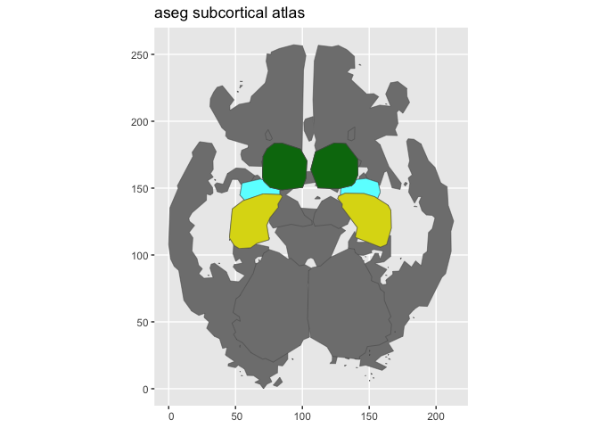

# ggseg.formats

ggseg.formats provides the `ggseg_atlas` S3 class that powers the
[ggseg](https://ggsegverse.github.io/ggseg/) ecosystem for 2D and 3D
brain visualisation. It ships three bundled atlases, a set of accessor
functions for querying atlas contents, and a pipe-friendly manipulation
API for subsetting, renaming, and enriching atlas objects.

## Bundled atlases

The package includes three atlases covering the main atlas types:

- **dk** — Desikan-Killiany cortical parcellation (68 regions)
- **aseg** — FreeSurfer automatic subcortical segmentation
- **tracula** — TRACULA white matter tract atlas

``` r
library(ggseg.formats)
```

``` r
plot(dk())
```


``` r
plot(aseg())
```


``` r
plot(tracula())
```


## Quick example

Atlas objects are designed for exploration and customisation. You can
query regions, filter views, and pipe operations together:

``` r
aseg_small <- aseg() |>
  atlas_region_keep("hippocampus|amygdala|thalamus") |>
  atlas_view_keep("coronal_3|axial_3") |>
  atlas_view_gather()
plot(aseg_small)
```



## Installation

Install from the ggsegverse r-universe:

``` r
options(repos = c(
    ggsegverse = 'https://ggsegverse.r-universe.dev',
    CRAN = 'https://cloud.r-project.org'))

install.packages('ggseg.formats')
```

Or install the development version from GitHub:

``` r
# install.packages("devtools")
devtools::install_github("ggsegverse/ggseg.formats")
```

## Learn more

- [`vignette("ggseg.formats")`](https://ggsegverse.github.io/ggseg.formats/articles/ggseg.formats.md)
  — understanding atlas structure and accessors
- [`vignette("atlas-manipulation")`](https://ggsegverse.github.io/ggseg.formats/articles/atlas-manipulation.md)
  — region, view, and metadata manipulation
